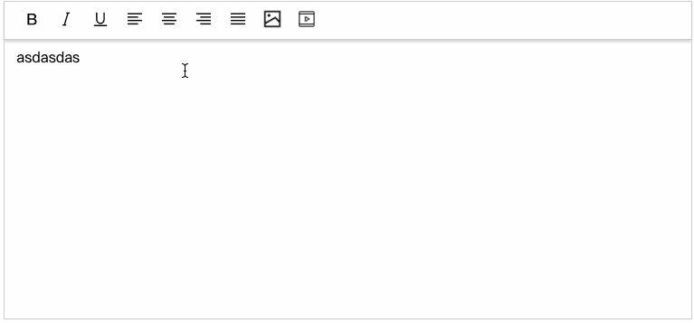

<h1 align="center">Easy Editor</h1>
<div align="center">A rich text editor based on slate </div>



[Demo](https://kanweiwei.github.io/easy-editor/example/)

## Quick Start

### npm

```bash
npm install @camol/easy-editor --save
```

### yarn

```bash
yarn install @camol/easy-editor -S
```

### Examples

```bash
git clone https://github.com/kanweiwei/easy-editor.git
cd easy-editor
yarn && yarn build && yarn example
```

### with React

```typescript
import * as React from "react";
import ReactDom from "react-dom";
import EasyEditor from "@camol/easy-editor";

class Editor extends React.Component {
  html = "";

  handleChange = (v: any) => {
    console.log("change=>>>", v);
    if (this.editorRef.current) {
      // value to html
      console.log(this.editorRef.current.convertor.serialize(v.change.value));
    }
  };

  render() {
    return <EasyEditor value={"<p>123</p>"} onChange={this.handleChange} />;
  }
}

ReactDom.render(<Editor />, document.getElementById("root"));
```

### Custom toolbar

For convenience, some tools have been built in the toolbar.
tool| instructions|
-|:-:|
bold| 加粗|
italic| 斜体|
u| 下划线|
sup| 上标 |
sub | 下标 |
left|文字居左|
right|文字居右|
center|文字居中|
justify|两端对齐|
image| 插入图片|
video | 插入音频（mp4、webm）|

#### How to add a custom tool ?

```typescript
import * as React from "react";
import ReactDom from "react-dom";
import EasyEditor from "@camol/easy-editor";

// audio tool
class AudioControl extends React.Component {
  inputRef = React.createRef();

  handleClick = () => {
    if (inputRef.current) {
      inputRef.current.click();
    }
  };

  handleChange = (e: React.ChangeEvent<HTMLInputElement>) => {
    const file = e.target.files[0];
    e.target.value = "";
    if (file) {
      if (this.props.beforeUpload) {
        let url = await this.props.beforeUpload(file);
        if (url) {
          let change = this.props.change.focus().insertInline({
            object: "inline",
            type: "audio",
            isVoid: true,
            data: {
              src: url,
            },
          });
          this.props.update(change);
        }
      }
    }
  };

  render() {
    return (
      <span onMouseDown={this.handleClick}>
        <span className="tool-insert-video" />
        <input
          type="file"
          style={{ width: 0, height: 0, opacity: 0 }}
          ref={this.inputRef}
          onChange={this.handleChange}
        />
      </span>
    );
  }
}

class Editor extends React.Component {
  html = "";

  handleChange = (v: any) => {
    console.log("change=>>>", v);
    if (this.editorRef.current) {
      // value to html
      console.log(this.editorRef.current.convertor.serialize(v.change.value));
    }
  };

  render() {
    return (
      <EasyEditor
        value={"<p>123</p>"}
        onChange={this.handleChange}
        controls={[
          ["bold", "u", "image"],
          [
            {
              type: "audio",
              component: (change, update, beforeUpload) => {
                return (
                  <AudioControl
                    change={change}
                    update={update}
                    beforeUpload={beforeUpload}
                  />
                );
              },
            },
          ],
        ]}
      />
    );
  }
}
```

---

### Custom Node Plugin

```typescript
import * as React from "react";
import { DefaultTreeElement } from "parse5";

const plugin = {
  type: "node", // node, mark
  object: "inline",
  nodeType: "super-audio",
  importer(el: DefaultTreeElement, next: Function): any {
    if (el.tagName.toLowerCase() === "audio") {
      return {
        object: "inline", // block、inline,
        type: "super-audio",
        isVoid: true,
        data: {
          src: el?.attrs?.find((n) => n.name === "src")?.value,
        },
        nodes: next(el.childNodes),
      };
    }
  },
  exporter(node: any, children: any): any {
    let { className, src } = node.data.toJS();
    return <audio src={src} className={className}></audio>;
  },
  render(
    editor: any,
    props: { attributes: any; children: any; node: any; isSelected: any }
  ): any {
    // @ts-ignore
    const { attributes, children, node, isSelected } = props;
    const src = node.data.get("src");
    return (
      <span {...attributes}>
        <audio src={src} controls>
          {children}
        </audio>
      </span>
    );
  },
};

export default plugin;
```

---

### License

Apache 2.0
